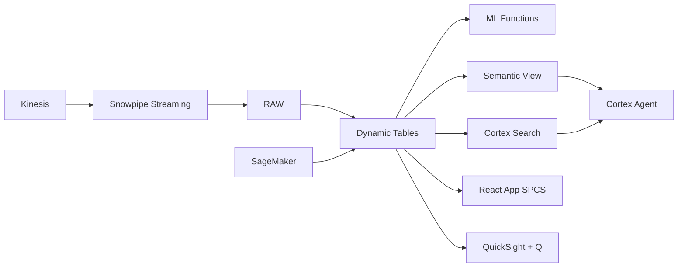

# Service Level Optimization & SLA Drift Detection

Philippine BPOs manage 200+ SLA metrics across dozens of clients — Snowflake detects SLA drift in real-time with anomaly detection, predicts breaches before they happen, and auto-triggers corrective workflows.

## Architecture

A top-10 Philippine BPO manages 200+ SLA metrics for 42 enterprise clients with combined contract value of ₱4.2 billion. Every quarter, SLA penalties cost ₱15-40M — but the real damage is client churn when accounts lose confidence. Traditional monitoring detects breaches after they happen. Snowflake detects drift days before breach, predicts impact, and auto-triggers remediation.



## Snowflake Capabilities

| Capability | Implementation |
|-----------|---------------|
| Dynamic Tables | SLA_HEALTH_REALTIME / PENALTY_EXPOSURE / STAFFING_GAP_ANALYSIS / SLA_TIMESERIES |
| ML Functions | ML.ANOMALY_DETECTION + ML.FORECAST |
| Cortex AI | COMPLETE, AI_CLASSIFY |
| Cortex Search | 42 documents indexed |
| Cortex Agent | SLA_OPERATIONS_AGENT |
| Semantic View | SLA_OPERATIONS_ANALYTICS |
| React App (SPCS) | 5 tabs + DemoGuide |


## AWS Services

| Service | Role in Demo |
|---------|-------------|
| Amazon Kinesis | Stream real-time 15-minute interval performance data |
| Amazon CloudWatch | Infrastructure monitoring and alarm aggregation |
| Amazon EventBridge | Event-driven remediation workflows on SLA drift |
| Amazon SageMaker | Anomaly detection models for SLA drift |
| Amazon QuickSight + Q | Real-time operational dashboard |
| AWS Step Functions | Orchestrate remediation workflows |


## Personas

| Persona | Role | Key Questions |
|---------|------|---------------|
| **Eduardo Jose Gonzales** | SVP Operations | "Which accounts are at risk of SLA breach this week?" "What's our total penalty exposure in pesos?" |
| **Angelica Mae Dela Cruz** | Service Delivery Manager | "Which intervals are showing anomalous abandon rates?" "Is AHT drifting on the FinServ account?" |


## Data

| Table | Rows | Description |
|-------|------|-------------|
| CLIENT_CONTRACTS | 42 | Client SLA contracts with penalty clauses |
| SLA_METRICS | 200 | SLA metric definitions per client (AHT, ASA, FCR, CSAT, abandon) |
| INTERVAL_PERFORMANCE | 1,200,000 | 15-minute interval operational metrics from Kinesis |
| STAFFING_SCHEDULES | 95,000 | Agent shift schedules and actual attendance |
| PENALTY_HISTORY | 380 | Historical SLA penalty incidents and credits issued |
| CLOUDWATCH_ALARMS | 15,000 | AWS CloudWatch operational alarms from contact center infra |


## Build Instructions

### Prerequisites
- Snowflake account with ACCOUNTADMIN access
- Cortex AI enabled (ML Functions, Search, Agent)
- Warehouse: SLA_WH (Medium)
- AWS CLI with access (us-west-2)

### Deployment

```bash
snowsql -f snowflake/00_setup.sql
snowsql -f snowflake/01_marketplace_install.sql
snowsql -f snowflake/02_raw_tables.sql
snowsql -f snowflake/03_staging.sql
snowsql -f snowflake/04_dynamic_tables.sql
snowsql -f snowflake/05_search.sql
snowsql -f snowflake/06_ml_models.sql
snowsql -f snowflake/07_semantic_view.sql
snowsql -f snowflake/08_agent.sql
```

### React App (SPCS)
```bash
cd app && npm ci && npm run build
docker build -t aws-philippines-bpo-sla-app .
docker push bdiqc8sm-default.registry.snowflakecomputing.com/sla_operations/app/aws_philippines_bpo_sla/app:latest
```

### Demo Mode
Open the app URL with `?demo=true` for presenter view.

## Build Modes

### Snowflake Only
Run scripts 00-08 (skip AWS-specific integration). Uses:
- **Snowpipe Streaming SDK** instead of Amazon Kinesis
- **Dynamic Tables + Alerts** instead of Amazon CloudWatch
- **Task Graphs + Notification Integration** instead of Amazon EventBridge
- **ML.ANOMALY_DETECTION (native)** instead of Amazon SageMaker
- **Snowflake Intelligence (Cortex Analyst)** instead of Amazon QuickSight + Q
- **Task Graphs (DAG orchestration)** instead of AWS Step Functions

### Full AWS + Snowflake
Run all scripts including AWS integration. Deploy QuickSight dashboard from `quicksight/`.

## Business Impact

Industry research and Snowflake customer outcomes:
- **SLA penalties cost Philippine BPOs $200-500M annually across the industry** — [Everest Group](https://www.everestgrp.com/research/market-insights)
- **Proactive SLA management reduces penalty payouts by 40-60%** — [Gartner](https://www.gartner.com/en/information-technology/insights/it-outsourcing)
- **Real-time anomaly detection identifies service degradation 3-5x faster than threshold alerts** — [McKinsey Digital](https://www.mckinsey.com/capabilities/mckinsey-digital/our-insights)


## Key Demo Numbers

- **200+** SLA metrics monitored in real-time
- **₱34M** projected penalty exposure this quarter
- **8 accounts** showing anomalous SLA drift
- **72 hours** advance warning before FinServ AHT breach
- **127 FTEs** staffing gap identified across graveyard shifts
- **₱8.5M saved** single remediation preventing FinServ penalty


## License

Apache 2.0 — See [LICENSE](LICENSE) for details.

This is a personal demo project and is not an official Snowflake offering. It comes with no support or warranty.